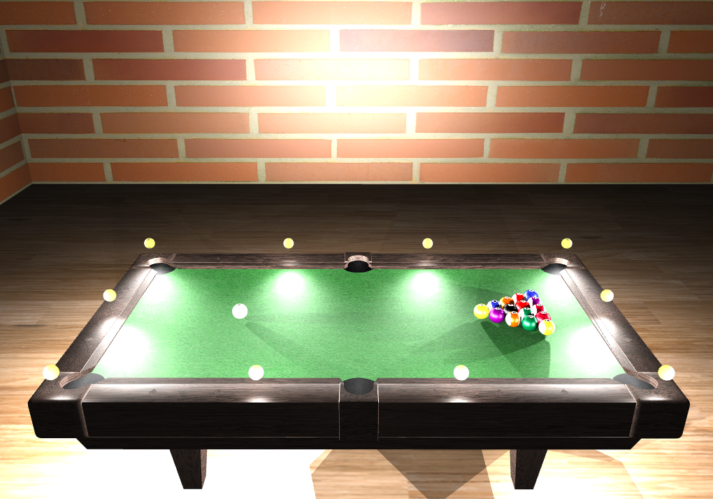
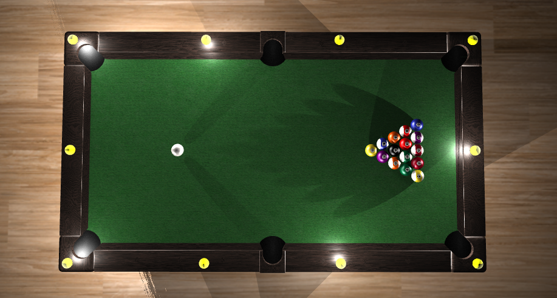
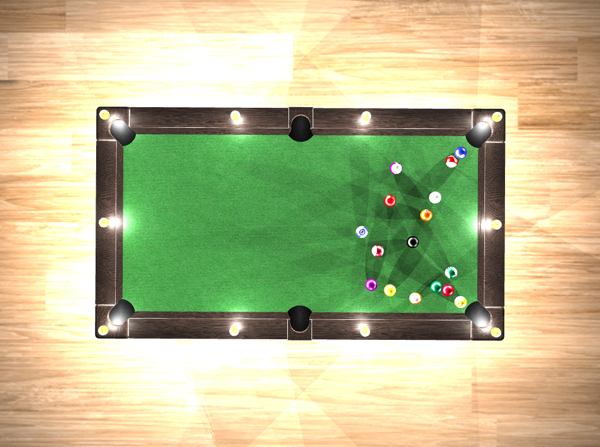
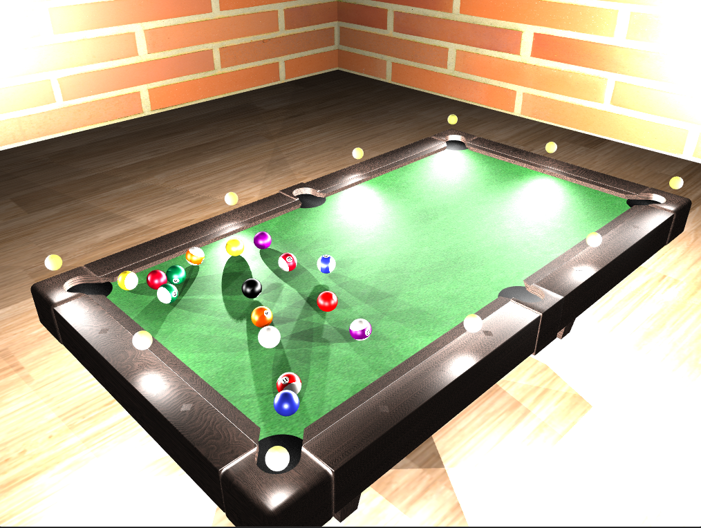

# 3D Billiard Game (C++ & OpenGL)

## Overview
This project is a 3D billiard game built using C++ and OpenGL. The game simulates realistic billiard mechanics, including aiming, shooting, ball collisions, and spin effects. It also features lighting and shadow algorithms and free camera movement.

  
*A preview of the billiard game.*

## Features & Capabilities

### Camera System
- Free camera movement to explore the table.
- Overhead aiming mode for precise shots.

### Lighting & Shadows
- **Phong Lighting Model** implemented for smooth shading and realistic light reflections.
- 10 evenly spaced lights around the pool table.
- Each light can be toggled on/off using number keys 0-9.
- Dynamic lighting and shadow effects enhance realism.
- **Shadow Mapping** technique used to generate realistic shadows cast by the balls and cue stick.

*Lights toggled*

### Physics Simulation
- The game implements collision detection and friction for accurate ball movement.
- Spin implementation determined by user.

  
  

*Example of ball collision and spin effects.*

### Game 
- The game alternates turns between two players.
- Follows standard billiard rules.

### Controls
- **Mouse Controls**:
  - `Right-click`: Enter aiming mode (when balls are stationary).
  - `Left-click` (hold & release): Charge and release the shot.
- **Keyboard Controls**:
  - `W, A, S, D`: Move the camera.
  - `Q`: Exit aiming mode.
  - `P`: Toggle 2D cue ball projection (for spin adjustment).
  - `I, K, J, L`: Adjust cue stick targeting position (for spin effects).
  - `0-9`: Toggle individual lights around the table.
  - `R`: Reset the game.

## Build and Run Instructions

### Prerequisites
Ensure you have the following installed:
- CMake (version 3.x or later)
- Visual Studio

### Build Steps
1. **Open CMake GUI**
   - Launch CMake GUI.
2. **Select Source Code Directory**
   - Click "Browse Source" and select your project's root directory.
3. **Select Build Directory**
   - Click "Browse Build" and create/select a `build` directory.
4. **Configure the Project**
   - Click "Configure" and "Finish".
5. **Generate Build Files**
   - Click "Generate".
6. **Build the Project**
   - Open the generated `.sln` file in Visual Studio and build the project.

## Future Enhancements
- Enhanced AI for single-player mode.
- Improved graphics and visual effects.
- Multiplayer support via network play.

---
This README provides a structured overview of the project, detailing both the development process and gameplay mechanics. Let me know if you'd like any modifications!

